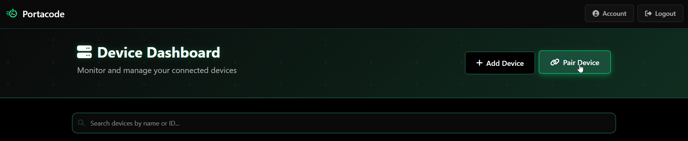
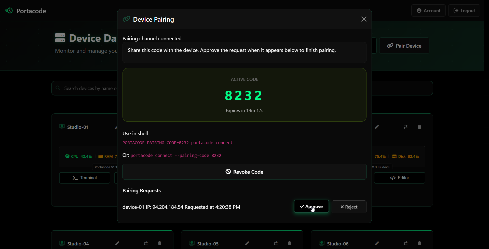

# Portacode

**An AI-first, mobile-first IDE and admin tool, made with love and passion by software engineers, for software engineers.**

Portacode transforms any device with python into a remotely accessible development environment. Access your home lab, server or even embedded system chip from your phone, code on your desktop or your smartphone from anywhere, or help a colleague debug their server - all through a beautiful web interface designed for the modern developer.

## ✨ Why Portacode?

- **🤖 AI-First**: Built from the ground up with AI integration in mind
- **📱 Mobile-First**: Code and administrate from your phone or tablet
- **🌍 Global Access**: Connect to your devices from anywhere with internet
- **🔐 Secure**: HTTPS encrypted with RSA key authentication
- **⚡ Fast Setup**: Get connected in under 60 seconds
- **🔄 Always Connected**: Automatic reconnection and persistent service options
- **🆓 Free Account**: Create your account and start connecting immediately
- **🖥️ Cross-Platform**: Works on Windows, macOS, and Linux

## 🚀 Quick Start

### 1. Install Portacode

```bash
pip install portacode
```

### 2. Connect Your Device

```bash
portacode connect
```

Follow the on-screen instructions to:
- Visit [https://portacode.com](https://portacode.com)
- Create your free account
- Add your device using the generated key
- Start coding and administrating!

### 3. Access Your Development Environment

Once connected, you can:
- Open terminal sessions from the web dashboard
- Execute commands remotely
- Monitor system status
- Access your development environment from any device

## 🔑 Pair Devices with Zero-Touch Codes

The fastest way to bring a new machine online is with a short-lived pairing code:

1. Log in to [https://portacode.com](https://portacode.com) and press **Pair Device** on the dashboard:  
   
2. A four-digit code appears (valid for 15 minutes). This code only authorizes a pairing **request**—no device can reach your account until you approve it.
3. On the device, run Portacode with the code:
   ```bash
   PORTACODE_PAIRING_CODE=1234 portacode connect \
     --device-name "My Laptop" \
     --project-path /srv/project-one \
     --project-path /srv/project-two
   ```
   - `--device-name` (or `PORTACODE_DEVICE_NAME`) pre-fills the friendly label shown in the dashboard.
   - Repeat `--project-path /abs/path` to register up to ten Projects automatically once the request is approved.
   - Automating inside Docker? Export your own `PORTACODE_PROJECT_PATHS=/srv/a:/srv/b` and convert it into repeated `--project-path` switches before invoking the CLI—see `portacode_for_school/persistent_workspace/entrypoint.sh` for a reference implementation.
4. Because the device has no fingerprint yet, the CLI bootstraps an in-memory keypair and announces a pending request to the dashboard. You immediately see the card with the supplied metadata:  
   
5. Click **Approve**. The CLI persists the keypair on disk and transitions into a normal authenticated connection. Future `portacode connect` runs reuse the stored RSA keys—no additional codes required unless you revoke the device.

Need to pair multiple machines at once? A single pairing code can be reused concurrently: every device that launches `portacode connect` with that code shows up as its own approval card until you accept or decline it.

This workflow works great for headless setups and containers: export the environment variables, run `portacode connect --non-interactive`, and finish the approval from the dashboard.

## 💡 Use Cases

- **Remote Development**: Code, build, and debug from anywhere - even your phone
- **Server Administration**: 24/7 server access with persistent service installation
- **Mobile Development**: Full IDE experience on mobile devices

## 🔧 Essential Commands

### Basic Usage
```bash
# Start a connection (runs until closed)
portacode connect

# Run connection in background
portacode connect --detach

# Check version
portacode --version

# Get help
portacode --help
```

### Service Management
```bash
# First, authenticate your device
portacode connect

# For system services, install package system-wide
sudo pip install portacode --system

# Install persistent service (auto-start on boot)
sudo portacode service install

# Check service status (use -v for verbose debugging)
sudo portacode service status
sudo portacode service status -v

# Stop/remove the service
sudo portacode service stop
sudo portacode service uninstall
```

## 🌐 Web Dashboard

Access your connected devices at [https://portacode.com](https://portacode.com)

**Current Features:**
- Real-time terminal access
- System monitoring
- Device management
- Multi-device switching
- Secure authentication

**Coming Soon:**
- AI-powered code assistance
- Mobile-optimized IDE interface
- File management and editing
- Collaborative development tools

## 🔐 Security

- **RSA Key Authentication**: Each device gets a unique RSA key pair
- **HTTPS Encrypted**: All communication is encrypted in transit
- **No Passwords**: Key-based authentication eliminates password risks
- **Revocable Access**: Remove devices instantly from the web dashboard
- **Local Key Storage**: Private keys never leave your device

## 🆘 Troubleshooting

### Connection Issues
```bash
# Check if another connection is running
portacode connect

# View service logs
sudo portacode service status --verbose
```

### Service Installation Issues
```bash
# First authenticate your device
portacode connect

# If service commands fail, ensure system-wide installation
sudo pip install portacode --system

# Then try service installation again
sudo portacode service install

# Use verbose status to debug connection issues
sudo portacode service status -v
```

### Clipboard Issues (Linux)
```bash
# Install clipboard support
sudo apt-get install xclip
```

### Key Management
Portacode follows the OS-specific *user data* directory (via [`platformdirs`](https://pypi.org/project/platformdirs/)) and keeps its identity in `portacode/keys/`:
- **Linux**: `~/.local/share/portacode/keys/`
- **macOS**: `~/Library/Application Support/portacode/keys/`
- **Windows**: `%APPDATA%\portacode\keys\`

When `PORTACODE_PAIRING_CODE` is set, the CLI generates an in-memory keypair, waits for dashboard approval, and only then writes the files to this directory. If that folder disappears, the CLI will create a fresh identity next time it runs.

#### Persisting Keys in Containers
Docker images (including the simple `python:3.11-slim` example that runs Portacode as `root`) store the data inside `/root/.local/share/portacode`. Bind-mount that path or override `XDG_DATA_HOME` so the keys survive container restarts:

```yaml
services:
  device-01:
    build: .
    environment:
      PORTACODE_PAIRING_CODE: "${PORTACODE_PAIRING_CODE:-}"
    volumes:
      - ./data/device-01/workspace:/root/workspace
      - ./data/device-01/.local/share/portacode:/root/.local/share/portacode  # persists device keys
```

Alternatively, set `XDG_DATA_HOME=/root/.portacode` before running `portacode connect` and mount that directory from the host. The rule of thumb: **persist whichever folder contains `.local/share/portacode/keys/`** so your device fingerprint sticks around.

## 🌱 Early Stage Project

**Portacode is a young project with big dreams.** We're building the future of remote development and mobile-first coding experiences. As a new project, we're actively seeking:

- **👥 Community Feedback**: Does this solve a real problem for you?
- **🤝 Contributors**: Help us build the IDE of the future
- **📢 Early Adopters**: Try it out and let us know what you think
- **💡 Feature Ideas**: What would make your remote development workflow better?

**Your support matters!** Whether you contribute code, report bugs, share ideas, or simply let us know that you find value in what we're building - every bit of feedback helps us decide whether to continue investing in this vision or focus on other projects.

## 📞 Get In Touch

- **Email**: hi@menas.pro
- **Support**: support@portacode.com
- **GitHub**: [https://github.com/portacode/portacode](https://github.com/portacode/portacode)

## 🤝 Contributing

We welcome all forms of contribution:
- 🐛 **Bug Reports**: Found something broken? Let us know!
- ✨ **Feature Requests**: What would make Portacode better for you?
- 📖 **Documentation**: Help others get started
- 💻 **Code Contributions**: Help us build the future of remote development
- 💬 **Feedback**: Tell us if you find this useful!

Check out our [GitHub repository](https://github.com/portacode/portacode) to get started.

## 📄 License


---

**Get started today**: `pip install portacode && portacode connect`

*Built with ❤️ and ☕ by passionate software engineers* 
